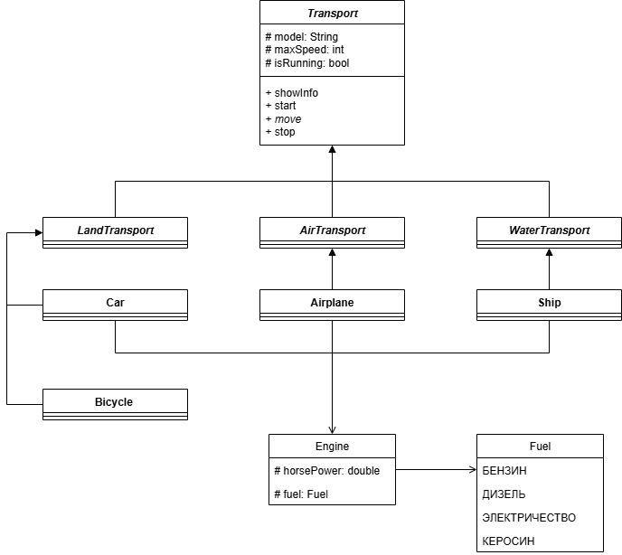

# Иерархия транспортных средств

## Описание проекта
Проект реализует иерархию классов для описания различных видов транспорта с использованием 
sealed-классов, enum-перечислений, абстрактных классов, конечных классов и пользовательского интерфейса в консоли.

Пользователь может:
- выбрать тип транспорта (автомобиль, самолет, корабль, велосипед);
- задать модель, скорость, мощность двигателя и тип топлива;
- вызывать методы для показа информации, запуска, движения и остановки.

## Основные классы

### 'Transport' (sealed abstract class)
Базовый класс для всех видов транспорта.  
Содержит общие поля и методы:
- 'model' — модель транспорта
- 'maxSpeed' — максимальная скорость
- 'isRunning' — флаг состояния (показать информацию, запуск, движение, остановка)

### Подклассы (non-sealed)
- 'LandTransport' - наземный транспорт
- 'AirTransport' - воздушный транспорт
- 'WaterTransport' - водный транспорт

### Конечные классы (final)
- 'Car' - автомобиль
- 'Airplane' - самолет
- 'Ship' - корабль
- 'Bicycle' - велосипед

### Дополнительные классы
- 'Engine' - двигатель (мощность, топливо)
- 'Fuel' - топливо (бензин, дизель, электричество, керасин)

## UML-диаграмма

